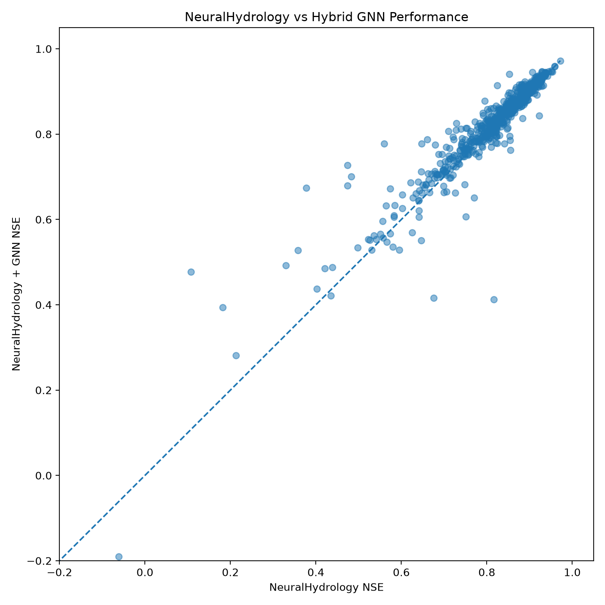
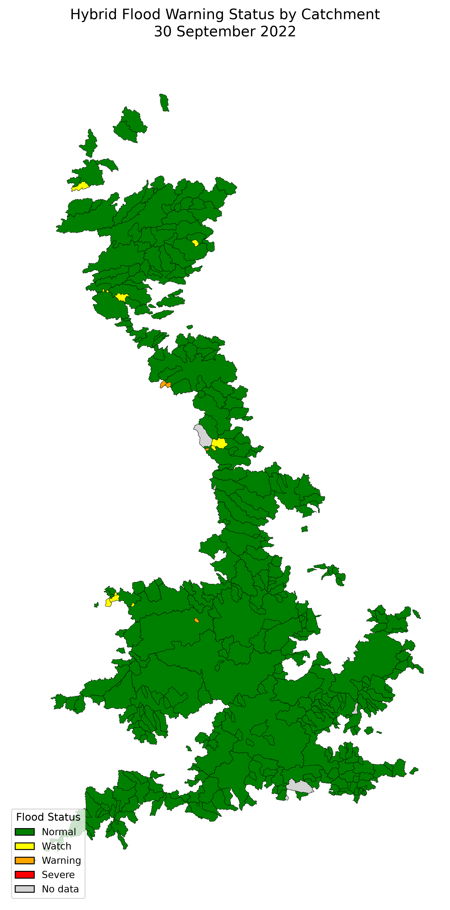

# 🌊 Hybrid Flood Warning System

A flood prediction and warning system that combines **NeuralHydrology** with a **Graph Neural Network (GNN)** using the **CAMELS-GB V2** dataset.

The system predicts river discharge for UK catchments, applies spatial GNN-based residual correction, classifies flood risk using catchment-specific statistical thresholds, and displays the results through an interactive Streamlit dashboard.

---

## 📌 Project Overview

The complete system follows this pipeline:

```text
CAMELS-GB V2
      ↓
Data Preprocessing
      ↓
NeuralHydrology LSTM
      ↓
Discharge Prediction
      ↓
Spatial 5-Nearest-Neighbour Graph
      ↓
Normalized GNN Residual Correction
      ↓
Final Hybrid Discharge Prediction
      ↓
Flood Warning Thresholds
      ↓
Normal / Watch / Warning / Severe
      ↓
Interactive Streamlit Dashboard
```

---

## 🎯 Project Objective

The main goal of this project is to investigate whether spatial relationships between nearby catchments can improve river discharge predictions generated by a temporal hydrological model.

The project combines:

- **NeuralHydrology LSTM** for temporal hydrological modelling
- **Graph Neural Network** for spatial residual correction
- **Catchment-specific thresholds** for flood warning classification
- **Streamlit and Folium** for interactive visualization

---

## 📦 Dataset

This project uses the **CAMELS-GB V2** dataset.

The dataset contains:

- Hydrometeorological time-series data
- River discharge observations
- Catchment attributes
- Catchment boundaries

The complete dataset is not stored in this repository because of its large size.

Expected local structure:

```text
data/
├── attributes/
├── boundaries/
└── timeseries/
    └── hydro-meteorological/
        └── daily/
```

---

## 🧠 NeuralHydrology Model

The temporal hydrological component uses the **NeuralHydrology** framework with an LSTM-based model.

### Dynamic Inputs

The final experiment uses:

- HADUK precipitation
- HADUK temperature
- HydroPE potential evapotranspiration

### Static Catchment Attributes

The model also uses:

- Catchment area
- Mean elevation
- Sand percentage
- Silt percentage
- Clay percentage
- Mean precipitation
- Mean potential evapotranspiration

The final experiment includes approximately **666 CAMELS-GB catchments**.

---

## 🕸️ Graph Neural Network

After NeuralHydrology produces discharge predictions, a Graph Neural Network is used to learn spatial residual corrections.

Each catchment is represented as a graph node.

The graph is created using the **5 nearest neighbouring catchments** based on catchment centroid distance.

The residual is defined as:

```text
Residual = Observed Discharge - NeuralHydrology Prediction
```

The final hybrid prediction is:

```text
Final Prediction =
NeuralHydrology Prediction + GNN Predicted Residual
```

The GNN uses a simple two-layer Graph Convolutional Network:

```text
GCNConv
   ↓
ReLU
   ↓
GCNConv
```

Basin-wise normalization is performed using statistics calculated from the GNN training period only.

---

## 📊 Final Model Evaluation

The final hybrid system was evaluated on **645 catchments**.

| Metric | NeuralHydrology | NH + GNN | Better Model |
|---|---:|---:|---|
| NSE ↑ | 0.8462 | **0.8549** | NH + GNN |
| KGE ↑ | 0.7877 | **0.8346** | NH + GNN |
| RMSE ↓ | 1.3333 | **1.2991** | NH + GNN |
| MAE ↓ | **0.6270** | 0.6392 | NeuralHydrology |

The normalized GNN improved NSE for:

```text
463 / 645 catchments
```

Overall, the hybrid model improved median:

- NSE
- KGE
- RMSE

Median MAE increased slightly, showing that the GNN improved overall hydrological performance but did not improve every error metric.

---

## 📈 NeuralHydrology vs Hybrid GNN



The diagonal line represents equal performance.

- Points above the line indicate catchments where the hybrid GNN improved NSE.
- Points below the line indicate catchments where NeuralHydrology performed better.

---

## 🚨 Flood Warning Classification

Different catchments have very different discharge ranges.

For this reason, a single fixed discharge threshold is not used.

Instead, warning thresholds are calculated separately for every catchment using historical training-period discharge.

The warning classes are:

```text
Prediction < Q90        → Normal

Q90 ≤ Prediction < Q95  → Watch

Q95 ≤ Prediction < Q99  → Warning

Prediction ≥ Q99        → Severe
```

Where:

```text
Q90 = 90th percentile historical discharge
Q95 = 95th percentile historical discharge
Q99 = 99th percentile historical discharge
```

These are statistical research thresholds and are **not official Environment Agency flood warning thresholds**.

---

## 🗺️ Flood Warning Map

The final hybrid discharge predictions are compared with each catchment's historical warning thresholds.

The resulting flood status is then joined with the CAMELS-GB catchment boundary shapefile.



For the prototype date:

```text
30 September 2022
```

The system produced:

| Status | Catchments |
|---|---:|
| Normal | 611 |
| Watch | 35 |
| Warning | 16 |
| Severe | 4 |
| No Data | 5 |

Total catchments displayed:

```text
671
```

---

## 💻 Interactive Flood Warning Dashboard

The project includes an interactive dashboard built using:

- Streamlit
- Folium
- GeoPandas
- Pandas

The dashboard provides:

- Interactive UK catchment map
- Flood warning status by catchment
- Basin ID
- Predicted discharge
- Watch threshold
- Warning threshold
- Severe threshold
- Severe flood alert table
- Basin selection
- Observed discharge time series
- NeuralHydrology prediction
- Hybrid NH + GNN prediction
- Watch, Warning and Severe threshold lines

Run the dashboard using:

```bash
streamlit run app.py
```

Then open:

```text
http://localhost:8501
```

---

## 🧩 System Architecture

```text
CAMELS-GB V2
      ↓
Hydrometeorological Inputs
      ↓
NeuralHydrology LSTM
      ↓
Daily Discharge Prediction
      ↓
5-Nearest-Neighbour Spatial Graph
      ↓
Normalized GNN
      ↓
Residual Correction
      ↓
Final Hybrid Discharge Prediction
      ↓
Q90 / Q95 / Q99 Thresholds
      ↓
Flood Warning Classification
      ↓
Interactive Dashboard
```

---

## 📂 Project Structure

```text
floodwarningsys/
│
├── app.py
├── install_custom_nh.py
├── README.md
├── .gitignore
│
├── basin_lists/
│   └── final_basins.txt
│
├── configs/
│   └── final_666_haduk.yml
│
├── custom_files_new/
│   ├── camelsgbv2.py
│   ├── camelsgbv2h.py
│   ├── config.py
│   └── __init__.py
│
├── scripts/
│   ├── build_final_basin_list.py
│   ├── export_nh_for_gnn.py
│   ├── build_gnn_graph.py
│   ├── train_gnn.py
│   ├── train_gnn_normalized.py
│   ├── evaluate_gnn.py
│   ├── evaluate_gnn_normalized.py
│   ├── build_warning_thresholds.py
│   ├── build_flood_status.py
│   ├── plot_final_results.py
│   ├── plot_flood_warning_map.py
│   ├── final_evaluation.py
│   └── create_final_results_table.py
│
└── outputs/
    ├── final_gnn_summary.txt
    ├── gnn_edges.csv
    ├── gnn_normalization.csv
    ├── gnn_normalized_test_metrics.csv
    ├── final_evaluation_metrics.csv
    ├── final_model_results.csv
    ├── flood_warning_thresholds.csv
    ├── latest_flood_status.csv
    ├── final_model_comparison.png
    ├── final_model_comparison_zoomed.png
    └── flood_warning_map.png
```

Large datasets, trained model files and large generated prediction files are excluded from GitHub.

---

## ⚙️ Technologies Used

The main technologies used in this project are:

- Python
- NeuralHydrology
- PyTorch
- PyTorch Geometric
- Pandas
- NumPy
- GeoPandas
- Matplotlib
- Folium
- Streamlit
- CAMELS-GB V2

---

## 🔧 Custom NeuralHydrology Setup

The project includes custom NeuralHydrology files for CAMELS-GB V2.

After installing NeuralHydrology, run:

```bash
python install_custom_nh.py
```

This copies the required custom dataset files into the installed NeuralHydrology package.

---

## ▶️ Running the Project

### 1. Prepare the Dataset

Place the CAMELS-GB V2 dataset inside:

```text
data/
```

---

### 2. Install Custom NeuralHydrology Files

```bash
python install_custom_nh.py
```

---

### 3. NeuralHydrology Configuration

The main configuration file is:

```text
configs/final_666_haduk.yml
```

---

### 4. Export NeuralHydrology Predictions

```bash
python scripts/export_nh_for_gnn.py
```

---

### 5. Build the Catchment Graph

```bash
python scripts/build_gnn_graph.py
```

---

### 6. Train the Normalized GNN

```bash
python scripts/train_gnn_normalized.py
```

---

### 7. Evaluate the Hybrid Model

```bash
python scripts/evaluate_gnn_normalized.py
```

---

### 8. Calculate Flood Warning Thresholds

```bash
python scripts/build_warning_thresholds.py
```

---

### 9. Generate Flood Warning Status

```bash
python scripts/build_flood_status.py
```

---

### 10. Generate the Static Map

```bash
python scripts/plot_flood_warning_map.py
```

---

### 11. Run the Interactive Dashboard

```bash
streamlit run app.py
```

---

## 🔬 Methodology Summary

The system separates temporal and spatial modelling.

### Temporal Modelling

```text
Meteorological Data
       ↓
NeuralHydrology LSTM
       ↓
Discharge Prediction
```

### Spatial Modelling

```text
NeuralHydrology Prediction
            +
Catchment Spatial Graph
            ↓
           GNN
            ↓
Residual Correction
```

### Flood Warning System

```text
Final Hybrid Prediction
          ↓
Historical Basin Thresholds
          ↓
Normal / Watch / Warning / Severe
          ↓
Interactive Map and Dashboard
```

---

## ⚠️ Limitations

This system is an academic research prototype and has several limitations.

### Spatial Connectivity

The current graph uses the **5 nearest neighbouring catchments based on centroid distance**.

It does not represent true upstream/downstream river-network connectivity.

### Statistical Warning Thresholds

The Q90, Q95 and Q99 thresholds are calculated from historical discharge.

They are not official flood-warning thresholds.

### Historical Predictions

The current dashboard demonstrates predictions from a historical evaluation period.

It is not currently connected to live rainfall, weather forecasts or river monitoring services.

### Missing Data

Some catchments do not contain sufficient prediction information and are displayed as:

```text
No Data
```

### Model Performance

The GNN improved performance for the majority of evaluated catchments, but improvement was not universal.

The hybrid model improved median NSE, KGE and RMSE, while median MAE was slightly worse than NeuralHydrology alone.

---

## 🔮 Future Work

Possible future improvements include:

- True river-network graph connectivity
- Upstream and downstream catchment relationships
- Real-time rainfall data
- Weather forecast integration
- Real-time discharge forecasting
- Official flood-warning threshold integration
- More GNN node features
- Forecast uncertainty estimation
- Automated flood alert notifications
- Public cloud deployment
- Mobile-friendly warning interface

---

## ⚠️ Disclaimer

This project is an **academic and research prototype**.

The flood warning levels produced by this system are based on historical statistical discharge thresholds.

They should **not be interpreted as official flood warnings or used for emergency decision-making**.